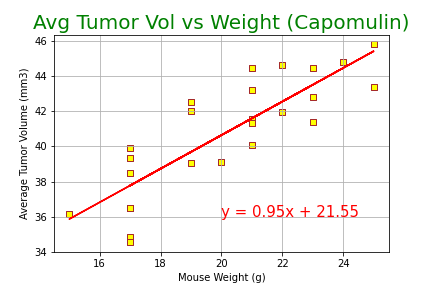
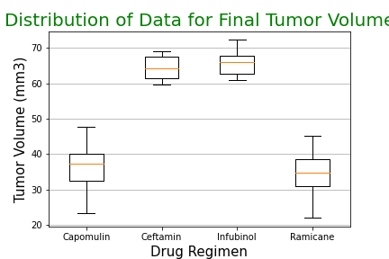
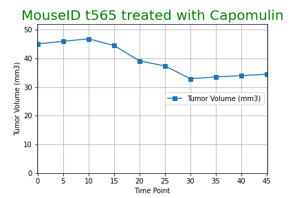

# matplotlib-submission
Various visualizations in pandas and matplotlib with pharmaceutical data

The line graph of average tumor volume by mouse is input driven; it shows a list of mice that took Capomulin, and user must select an ID to plot from the list. ID t565 was that of a mouse on Capomulin with tumor reducing results. Pharmaceutical analysis comparison of Capomulin with other tumor reducing medications.

A Linear Regression analysis on average tumor volume vs weight for mice on Capomulin demonstrates a positive correlation with a weight/slope of 0.95.

The lower tumor volume achieved by mice on Capomulin vs its competitors is notable on this box plot:

Finally, a mouse with ID t565 is shown to have a reduced tumor volume over time while on Capomulin:

